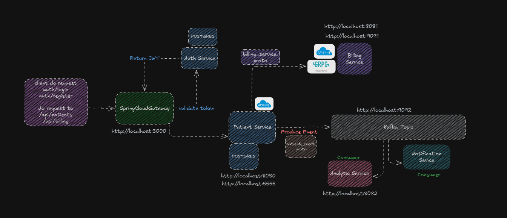

# 🚀 Microservice Architecture Overview

This project demonstrates a microservices-based architecture using Spring Boot, Kafka, PostgreSQL, gRPC, and Docker. Each service is containerized and communicates via REST, gRPC, or Kafka events.

---

## 📌 Architecture Flow

The following diagram illustrates the communication flow between services:



> Ensure the image `spring-microservice-flow.png` is located at the root of the repository or adjust the path if needed.

---

## 🧩 Microservices Overview

### 🌐 API Gateway
- **Spring Cloud Gateway** – Entry point (`http://localhost:3000`)
- Routes requests to Auth, Patient, and Billing services
- Validates JWT tokens from Auth Service

### 🔐 Auth Service
- Handles user authentication: `/auth/login`, `/auth/register`
- Issues JWTs and verifies them for the gateway
- Connected to a dedicated PostgreSQL instance (`postgres-auth-service`)
- Runs on `http://localhost:8083`

### 🧍 Patient Service
- Exposes patient-related endpoints (`http://localhost:8080`, `http://localhost:5555`)
- Communicates with Billing via gRPC
- Publishes patient-related events to Kafka

### 💰 Billing Service
- gRPC service running at `http://localhost:8081` and `http://localhost:9091`
- Responds to RPC requests from Patient Service

### 📊 Analytics Service
- Kafka consumer service
- Listens to patient events for analytical processing
- Available at `http://localhost:8082`

### 📬 Kafka
- Event broker at `http://localhost:9092`
- Used for asynchronous event streaming between services

### 🔔 Notification Service (Coming Soon)
> This service will be integrated in the future to handle event-based notifications (e.g., email, SMS, push alerts).

---

## 🐳 Running with Docker Compose

This project includes a `docker-compose.yml` file to orchestrate all services.  
To start the full environment, run:

```bash
docker-compose up -d
